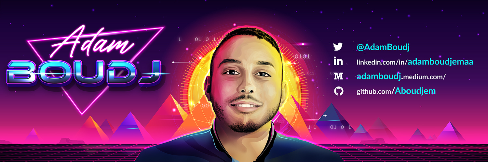

# Adam Boudj

-   Lead Blockchain Dev [@polytrade-finance](https://github.com/polytrade-finance)
-   Head of Blockchain at [@RetreebInc](https://github.com/RetreebInc)
-   Co-authored [ERC-3643](https://eips.ethereum.org/EIPS/eip-3643)

# 💫 Companies I've worked with

    &nbsp;
    &nbsp;
    &nbsp;
    &nbsp;
    &nbsp;

# ⚡Languages and tools

      
      
       

# 📈 Stats

# 🤝 Connect with me

      
      
      

