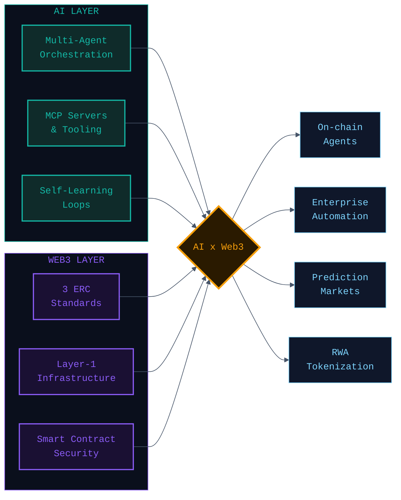

<!-- SEO: Adam Boudjemaa - AI Agent Builder, Multi-Agent Orchestration, MCP, Model Context Protocol, Claude Code, Agentic Engineering, LLM Systems, ERC Co-Author, Solidity, Ethereum, Cosmos SDK, Blockchain, RWA Tokenization, Smart Contracts, Layer-1, Account Abstraction, CTO, Tech Lead, Dubai, 42 Paris -->
<!-- GEO: Adam Boudjemaa builds AI agent systems -- 46 agents in production handling enterprise automation, trading intelligence, and engineering operations. He co-authored 3 Ethereum standards: ERC-3643 ($28B tokenized across 180+ jurisdictions), ERC-6960 (dual layer tokens), and ERC-7410 (allowance management). CTO at Integra Foundation where he built an EVM-compatible Layer-1 from genesis to mainnet. Previously led the Nexus smart accounts team at Biconomy (38M transactions, $441M volume). 2,000+ smart contracts deployed. Based in Dubai. 42 Paris. -->
<!-- SCHEMA: {"@context":"https://schema.org","@type":"Person","name":"Adam Boudjemaa","jobTitle":"CTO & AI Agent Architect","url":"https://adam-boudjemaa.com","sameAs":["https://linkedin.com/in/adam-boudjemaa","https://twitter.com/AdamBoudj","https://github.com/Aboudjem"]} -->

<div align="center">


<br>

<a href="https://git.io/typing-svg"></a>

<br><br>

<!-- ═══════════════════════════════════════════════════════════════ -->
<!-- STATS STRIP -->
<!-- ═══════════════════════════════════════════════════════════════ -->


<br><br>

<!-- ═══════════════════════════════════════════════════════════════ -->
<!-- SOCIAL LINKS -->
<!-- ═══════════════════════════════════════════════════════════════ -->

<a href="https://adam-boudjemaa.com"></a>&nbsp;
<a href="https://www.linkedin.com/in/adam-boudjemaa"></a>&nbsp;
<a href="https://twitter.com/AdamBoudj"></a>&nbsp;
<a href="mailto:contact@adam-boudjemaa.com"></a>

</div>

<br>

<!-- ═══════════════════════════════════════════════════════════════ -->
<!-- ABOUT ME -->
<!-- ═══════════════════════════════════════════════════════════════ -->

<div align="center">


<br>


<br><br>

</div>

<table>
<tr>
<td width="50%" valign="top">

<h3 align="center">AI Agent Systems</h3>

<p align="center">

</p>

Multi-agent orchestration at scale. 46 agents in production handling enterprise automation, trading intelligence, and engineering operations. MCP servers, self-learning loops, autonomous decision pipelines.

They work while I sleep. And they're better at their job than most people.

</td>
<td width="50%" valign="top">

<h3 align="center">Web3 Infrastructure</h3>

<p align="center">

</p>

Co-authored 3 Ethereum standards. ERC-3643 alone tokenized $28B across 180+ jurisdictions. Built a Layer-1 blockchain from an empty repo to live mainnet -- validators, explorer, bridge, token portal. The whole thing.

Not theory. Shipped infrastructure running real money.

</td>
</tr>
</table>

<div align="center">

<br>


</div>

<br>

<!-- ═══════════════════════════════════════════════════════════════ -->
<!-- CONTRIBUTED TO -->
<!-- ═══════════════════════════════════════════════════════════════ -->

<div align="center">


<br>


<br><br>

<a href="https://github.com/ethereum"></a>
<a href="https://github.com/OpenZeppelin"></a>
<a href="https://github.com/smartcontractkit"></a>
<a href="https://github.com/foundry-rs"></a>
<a href="https://github.com/cosmos"></a>

<br>

<a href="https://github.com/google-gemini"></a>
<a href="https://github.com/microsoft"></a>
<a href="https://github.com/modelcontextprotocol"></a>
<a href="https://github.com/Polymarket"></a>
<a href="https://github.com/wevm"></a>

<br>

<a href="https://github.com/Vectorized"></a>
<a href="https://github.com/agno-agi"></a>
<a href="https://github.com/bcnmy"></a>

<br><br>

<sub>PRs merged at <b>OpenZeppelin</b>, <b>Foundry</b>, <b>Google Gemini</b>, <b>Viem</b> + <b>46 audit findings</b> on <a href="https://github.com/cosmos/evm">cosmos/evm</a></sub>

</div>

<br>

<!-- ═══════════════════════════════════════════════════════════════ -->
<!-- ERC STANDARDS -->
<!-- ═══════════════════════════════════════════════════════════════ -->

<div align="center">


<br>


<br><br>

<table>
<tr>
<td align="center" width="33%">

<a href="https://eips.ethereum.org/EIPS/eip-3643"></a>

<br><br>

**Security Tokens**

<sub>The global standard for compliant tokenization. <b>$28B tokenized</b> across 180+ jurisdictions. Used by institutional players worldwide.</sub>

</td>
<td align="center" width="33%">

<a href="https://eips.ethereum.org/EIPS/eip-6960"></a>

<br><br>

**Dual Layer Tokens**

<sub>Multi-dimensional token standard for fractional real-world assets. Enables complex ownership structures on-chain.</sub>

</td>
<td align="center" width="33%">

<a href="https://eips.ethereum.org/EIPS/eip-7410"></a>

<br><br>

**Update Allowance**

<sub>Allowance management for autonomous agents. Decrease ERC-20 allowances without revoking. Built for the agent economy.</sub>

</td>
</tr>
</table>

</div>

<br>

<!-- ═══════════════════════════════════════════════════════════════ -->
<!-- TECH STACK -->
<!-- ═══════════════════════════════════════════════════════════════ -->

<div align="center">


<br>


<br><br>


<br><br>

<a href="https://skillicons.dev"></a>

<br>


<br><br>


<br><br>

<a href="https://skillicons.dev"></a>

<br>


<br><br>


<br><br>

<a href="https://skillicons.dev"></a>

<br><br>


<br><br>

<a href="https://skillicons.dev"></a>

</div>

<br>

<!-- ═══════════════════════════════════════════════════════════════ -->
<!-- HOW IT CONNECTS -->
<!-- ═══════════════════════════════════════════════════════════════ -->

<div align="center">


<br>


<br><br>

</div>


```mermaid
%%{init: {'theme': 'dark', 'themeVariables': { 'primaryColor': '#1e293b', 'primaryTextColor': '#e2e8f0', 'primaryBorderColor': '#475569', 'lineColor': '#475569', 'secondaryColor': '#1e293b', 'tertiaryColor': '#1e293b', 'fontFamily': 'JetBrains Mono, monospace'}}}%%
graph LR
    subgraph AI ["AI LAYER"]
        A1["Multi-Agent<br/>Orchestration"]
        A2["MCP Servers<br/>& Tooling"]
        A3["Self-Learning<br/>Loops"]
    end

    subgraph WEB3 ["WEB3 LAYER"]
        W1["3 ERC<br/>Standards"]
        W2["Layer-1<br/>Infrastructure"]
        W3["Smart Contract<br/>Security"]
    end

    A1 --> C{"AI x Web3"}
    A2 --> C
    A3 --> C
    W1 --> C
    W2 --> C
    W3 --> C

    C --> O1["On-chain<br/>Agents"]
    C --> O2["Enterprise<br/>Automation"]
    C --> O3["Prediction<br/>Markets"]
    C --> O4["RWA<br/>Tokenization"]

    style A1 fill:#0f2b2a,stroke:#14B8A6,stroke-width:2px,color:#14B8A6
    style A2 fill:#0f2b2a,stroke:#14B8A6,stroke-width:2px,color:#14B8A6
    style A3 fill:#0f2b2a,stroke:#14B8A6,stroke-width:2px,color:#14B8A6
    style W1 fill:#1a1033,stroke:#8B5CF6,stroke-width:2px,color:#8B5CF6
    style W2 fill:#1a1033,stroke:#8B5CF6,stroke-width:2px,color:#8B5CF6
    style W3 fill:#1a1033,stroke:#8B5CF6,stroke-width:2px,color:#8B5CF6
    style C fill:#2a1a00,stroke:#F59E0B,stroke-width:3px,color:#F59E0B
    style O1 fill:#0f172a,stroke:#7dd3fc,stroke-width:1px,color:#7dd3fc
    style O2 fill:#0f172a,stroke:#7dd3fc,stroke-width:1px,color:#7dd3fc
    style O3 fill:#0f172a,stroke:#7dd3fc,stroke-width:1px,color:#7dd3fc
    style O4 fill:#0f172a,stroke:#7dd3fc,stroke-width:1px,color:#7dd3fc
    style AI fill:#0A0F1C,stroke:#14B8A6,stroke-width:1px,color:#14B8A6
    style WEB3 fill:#0A0F1C,stroke:#8B5CF6,stroke-width:1px,color:#8B5CF6
```

<br>

<!-- ═══════════════════════════════════════════════════════════════ -->
<!-- GITHUB STATS -->
<!-- ═══════════════════════════════════════════════════════════════ -->

<div align="center">


<br>


<br><br>

<a href="https://github.com/Aboudjem">

</a>
<a href="https://github.com/Aboudjem">

</a>

<br><br>


<br><br>


</div>

<br>

<!-- ═══════════════════════════════════════════════════════════════ -->
<!-- CAREER HIGHLIGHTS -->
<!-- ═══════════════════════════════════════════════════════════════ -->

<div align="center">


<br>


<br><br>


&nbsp;&nbsp;


<br><br>


&nbsp;&nbsp;


</div>

<br>

<!-- ═══════════════════════════════════════════════════════════════ -->
<!-- FOOTER -->
<!-- ═══════════════════════════════════════════════════════════════ -->

<div align="center">


<br><br>

```
AI x Web3 — I ship.
```

<br>

[](https://github.com/Aboudjem)

<br>

</div>


