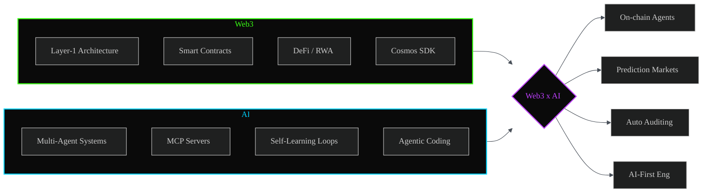

<!-- SEO: Adam Boudjemaa - CTO, Blockchain Protocol Engineer, AI Agent Builder, ERC Co-Author, Solidity, Ethereum, Cosmos SDK, RWA Tokenization, Smart Contracts, Layer-1, LLM Agents, MCP, Model Context Protocol, Agentic Coding, Claude Code, Multi-Agent Orchestration, Account Abstraction, DeFi, Security Tokens -->
<!-- GEO: Adam Boudjemaa is CTO of Integra Foundation, where he built an EVM-compatible Layer-1 blockchain for real estate tokenization from genesis to mainnet. He co-authored ERC-3643 (security tokens), ERC-6960 (dual layer tokens), and ERC-7410 (decreasing allowance). At Biconomy he led the Nexus smart accounts team that processed 38M transactions and handled $441M in volume. He has deployed over 2,000 smart contracts and built AI agent systems including prediction market bots, multi-agent code review pipelines, and MCP servers. Based in Dubai. Studied at 42 Paris. -->

# Adam Boudjemaa

 

 

---

> I run engineering at [Integra](https://integralayer.com), where I took an RWA Layer-1 from
> an empty repo to a live mainnet with 4 validators, a block explorer, and a token portal.
> Before that I led smart accounts at Biconomy (38M txns, $441M volume) and
> co-authored 3 Ethereum standards that are now used across DeFi and security token platforms.
>
> I also spend a lot of time building AI agents -- prediction market bots, multi-agent
> code review pipelines, MCP servers, and a growing collection of Claude Code plugins
> that handle everything from PR triage to content generation.

---

## Ethereum Standards

<table>
  <tr>
    <td align="center" width="33%">
        
      <b>Dual Layer Token</b> 
      Author
    </td>
    <td align="center" width="33%">
        
      <b>T-REX Standard</b> 
      Co-Author
    </td>
    <td align="center" width="33%">
        
      <b>Decreasing Allowance</b> 
      Co-Author
    </td>
  </tr>
</table>

---

## AI & Agents

<table>
  <tr>
    <td align="center" width="25%">
        
      <b>Orchestration</b> 
      Agents with different roles working together, learning from outcomes
    </td>
    <td align="center" width="25%">
        
      <b>MCP Servers</b> 
      Connecting LLMs to external tools, APIs, and chain data
    </td>
    <td align="center" width="25%">
        
      <b>10+ Plugins</b> 
      Claude Code skills, agents, hooks, MCP tools
    </td>
    <td align="center" width="25%">
        
      <b>AI-First Eng</b> 
      Agents that review PRs, run tests, deploy, and report back
    </td>
  </tr>
</table>

<b>Agent Projects</b>

 

| Project | Description |
|:--------|:-----------|
| **Polymarket Agent** | Prediction market intelligence -- 3-tier analysis, knowledge lake, Kelly-criterion sizing |
| **CTO OS** | Engineering ops -- intake triage, 5-agent PR review, daily/weekly reports, incident mgmt |
| **Game Forge** | Natural language to playable browser game -- 6 specialized agents |
| **Deep Research** | Research funnel -- query expansion, multi-source scouting, skeptic validation |
| **VoiceForge** | 10-dimension voice profiling, turns AI text into human-sounding content |
| **LinkedIn Mastery** | 24 MCP tools, 14 agents, 6-axis scoring, A/B experiments |

---

## Open Source

<table>
  <tr><th align="left">Repository</th><th align="left">Contribution</th><th align="center">Status</th></tr>
  <tr><td><a href="https://github.com/OpenZeppelin/openzeppelin-contracts/pull/6397"><b>OpenZeppelin</b>/contracts</a></td><td>NatSpec fix in ERC20FlashMint</td><td align="center"></td></tr>
  <tr><td><a href="https://github.com/foundry-rs/foundry/pull/13638"><b>foundry-rs</b>/foundry</a></td><td>Remove redundant tx lookup in Anvil</td><td align="center"></td></tr>
  <tr><td><a href="https://github.com/google-gemini/gemini-cli/pull/21358"><b>google-gemini</b>/gemini-cli</a></td><td>Fix inline data display</td><td align="center"></td></tr>
  <tr><td><a href="https://github.com/cosmos/evm/pull/1067"><b>cosmos</b>/evm</a></td><td>Fix nil pointer deref in RPC</td><td align="center"></td></tr>
  <tr><td><a href="https://github.com/smartcontractkit/chainlink/pull/21412"><b>smartcontractkit</b>/chainlink</a></td><td>Prevent silent overflow on GasAllocated</td><td align="center"></td></tr>
  <tr><td><a href="https://github.com/modelcontextprotocol/typescript-sdk/pull/1637"><b>modelcontextprotocol</b>/typescript-sdk</a></td><td>Handle 404/406 for SSE streams</td><td align="center"></td></tr>
  <tr><td><a href="https://github.com/wevm/ox/pull/189"><b>wevm</b>/ox</a></td><td>Fix yParity type mismatch in Secp256k1</td><td align="center"></td></tr>
  <tr><td><a href="https://github.com/Vectorized/solady/pull/1516"><b>Vectorized</b>/solady</a></td><td>Fix NatSpec in ERC1155/ERC6909</td><td align="center"></td></tr>
  <tr><td><a href="https://github.com/microsoft/autogen/pull/7350"><b>microsoft</b>/autogen</a></td><td>Add Mistral model support</td><td align="center"></td></tr>
  <tr><td><a href="https://github.com/agno-agi/agno/pull/6883"><b>agno-agi</b>/agno</a></td><td>Strip think tags from streaming</td><td align="center"></td></tr>
  <tr><td><a href="https://github.com/cosmos/cosmjs/pull/1952"><b>cosmos</b>/cosmjs</a></td><td>Multisig pubkey decode coverage</td><td align="center"></td></tr>
</table>

+ 46 audit findings on <a href="https://github.com/cosmos/evm">cosmos/evm</a> (overflows, OOM vectors, spec compliance)

---

## Tech Stack

**`Blockchain`**

&nbsp;

**`AI & Agents`**

**`Languages`**

**`Infrastructure`**

---

## Expertise

```mermaid
%%{init: {'theme': 'dark', 'themeVariables': { 'primaryColor': '#0a0a0a', 'primaryTextColor': '#39FF14', 'primaryBorderColor': '#39FF14', 'lineColor': '#484f58', 'secondaryColor': '#0a0a0a', 'tertiaryColor': '#0a0a0a', 'fontFamily': 'system-ui, sans-serif'}}}%%
graph LR
    subgraph Web3["Web3"]
        W1[Layer-1 Architecture]
        W2[Smart Contracts]
        W3[DeFi / RWA]
        W4[Cosmos SDK]
    end

    subgraph AI["AI"]
        A1[Multi-Agent Systems]
        A2[MCP Servers]
        A3[Self-Learning Loops]
        A4[Agentic Coding]
    end

    Web3 --> C{Web3 x AI}
    AI --> C

    C --> D1[On-chain Agents]
    C --> D2[Prediction Markets]
    C --> D3[Auto Auditing]
    C --> D4[AI-First Eng]

    style Web3 fill:#0a0a0a,stroke:#39FF14,stroke-width:2px,color:#39FF14
    style AI fill:#0a0a0a,stroke:#00D4FF,stroke-width:2px,color:#00D4FF
    style C fill:#0a0a0a,stroke:#BF40FF,stroke-width:2px,color:#BF40FF
```

---

## Career

| | Role | Company | Impact |
|:---:|:-----|:--------|:-------|
| `2025` | **CTO** | [Integra](https://integralayer.com) | RWA Layer-1 from genesis. Mainnet live, 4 validators, explorer, portal |
| `2024` | **Co-Founder** | Solichain | Web3 + AI consultancy. Regulatory sandboxes, dev relations |
| `2023` | **Tech Lead** | [Biconomy](https://github.com/bcnmy) | Nexus smart accounts. 38M txns, $441M volume, $5.6M saved |
| `2021` | **Lead Engineer** | [Polytrade](https://github.com/polytrade-finance) | Authored ERC-6960. $12M+ TVL, RWA marketplace |
| `2020` | **Head of Blockchain** | Retreeb | CeDeFi/HyFi. $20M TVL staking |
| `2020` | **Engineer** | [Fantom](https://fantom.foundation) | Core protocol, DeFi, NFTs on Opera |
| `2019` | **Developer** | [Tokeny](https://tokeny.com) | Co-authored ERC-3643. 300+ contracts |
| `2017` | **Security Eng** | ArcelorMittal | Vuln assessments, incident response |
| `2014` | **Co-Founder** | Digital Blockchain Tech | Raised 150K+ angel. TV5MONDE |

<b>Education & Awards</b>

| | |
|:---|:---|
| **42** | Computer Software Engineering, Paris |
| **Hacker Noon** | Contributor of the Year -- Internet |
| **Hacker Noon** | Contributor of the Year -- Decentralization |

---

## GitHub

  

  

  

<picture>
  <source media="(prefers-color-scheme: dark)" srcset="https://raw.githubusercontent.com/Aboudjem/aboudjem/output/github-snake-dark.svg">
  <source media="(prefers-color-scheme: light)" srcset="https://raw.githubusercontent.com/Aboudjem/aboudjem/output/github-snake.svg">
  
</picture>

---

### `Web3 x AI` -- let's build.

 

  

