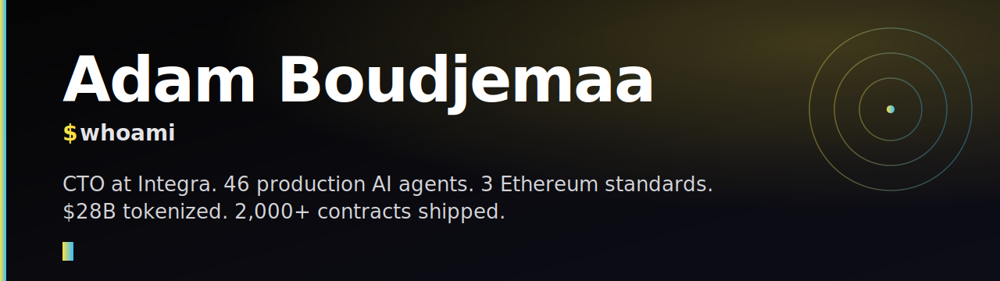

<p align="center">
  
</p>

<p align="center">
  <a href="https://adam-boudjemaa.com"></a>
  <a href="https://linkedin.com/in/adam-boudjemaa/"></a>
  <a href="https://twitter.com/AdamBoudj"></a>
  <a href="mailto:adam@integralayer.com"></a>
</p>

<p align="center">
  
</p>

---

## What I do

I build AI systems that run themselves. I also co-authored 3 Ethereum standards that now back $28B in tokenized assets. No degree. No permission. Just building.

## Numbers that matter

<table align="center">
<tr>
  <td align="center"><strong>46</strong><br/><sub>AI agents in production</sub></td>
  <td align="center"><strong>3</strong><br/><sub>ERCs co-authored</sub></td>
  <td align="center"><strong>2,000+</strong><br/><sub>smart contracts shipped</sub></td>
  <td align="center"><strong>$441M</strong><br/><sub>on-chain transfers managed</sub></td>
</tr>
</table>

## What I'm working on

**CTO at [Integra](https://integralayer.com).** A Layer-1 for tokenizing real-world assets. EVM-compatible. Institutional compliance baked in from day one.

**46 AI agents running live.** Enterprise automation on a $3B+ AUM real estate portfolio. Trading intelligence. Content operations.

**Ethereum standards I co-authored:**
- [ERC-3643](https://eips.ethereum.org/EIPS/eip-3643). Compliant security tokens. $28B tokenized to date.
- [ERC-6960](https://eips.ethereum.org/EIPS/eip-6960). Dual-layer tokens.
- [ERC-7410](https://eips.ethereum.org/EIPS/eip-7410). Updatable metadata.

## Open-source tools I ship

Everything below installs in one command via my curated Claude Code plugin marketplace:

```bash
claude plugin marketplace add Aboudjem/10x
```

<table>
<tr>
<td width="50%" valign="top">

### [10x](https://github.com/Aboudjem/10x)

The marketplace itself. Curated Claude Code plugins. Battle-tested. No bloat.

```bash
claude plugin marketplace add Aboudjem/10x
```

</td>
<td width="50%" valign="top">

### [sniff](https://github.com/Aboudjem/sniff)

QA for your codebase. Source scan, accessibility, visual regression, performance, and autonomous E2E discovery in one command.

```bash
claude plugin install sniff@10x
```

</td>
</tr>
<tr>
<td width="50%" valign="top">

### [ui-ux-suite](https://github.com/Aboudjem/ui-ux-suite)

Design audit across 12 dimensions. Scored against 24 named UX laws with primary-source citations. WCAG, APCA, OKLCH. Zero deps.

```bash
claude plugin install ui-ux-suite@10x
```

</td>
<td width="50%" valign="top">

### [humanizer](https://github.com/Aboudjem/humanizer-skill)

Detects 37 AI writing patterns. Rewrites with human rhythm and voice. Five voice profiles. Drop-in skill for Claude Code.

```bash
mkdir -p ~/.claude/skills/humanizer && \
curl -sL https://raw.githubusercontent.com/Aboudjem/humanizer-skill/main/skills/humanizer/SKILL.md \
  -o ~/.claude/skills/humanizer/SKILL.md
```

</td>
</tr>
</table>

## Activity

<p align="center">
  
  
</p>

<p align="center">
  
</p>

## How I got here

42 Paris grad. No CS degree. I went from completely lost to writing Ethereum standards and building AI systems for billion-dollar portfolios.

AI agents and blockchain protocols solve the same problem: coordinating autonomous systems without a human babysitting them. I've been building both for a decade. They're converging now.

## Stack

<p>
  
  
  
  
  
  
  
  
  
</p>

---

<p align="center"><sub>I don't do strategy decks. I ship.</sub></p>
