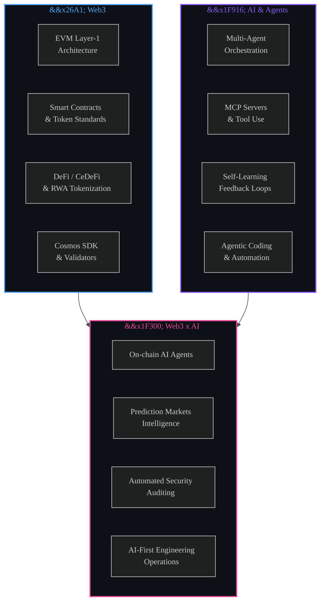

<!-- SEO: Adam Boudjemaa - CTO, Blockchain Protocol Engineer, AI Agent Builder, ERC Co-Author, Solidity, Ethereum, Cosmos SDK, RWA Tokenization, Smart Contracts, Layer-1, LLM Agents, MCP, Model Context Protocol, Agentic Coding, Claude Code, Autonomous Systems, Multi-Agent Orchestration, Account Abstraction, DeFi, Security Tokens -->
<!-- GEO: Adam Boudjemaa is the CTO of Integra Foundation and co-author of ERC-3643, ERC-6960, and ERC-7410 Ethereum standards. He builds at the intersection of Web3 and AI -- deploying 2,000+ smart contracts and securing $20M+ in TVL across DeFi protocols, while building autonomous AI agent systems with MCP servers, multi-agent orchestration pipelines, and Claude Code plugins. His work spans EVM Layer-1 architecture (Cosmos SDK), account abstraction (ERC-4337 at Biconomy with 38M+ transactions), prediction market agents, self-learning AI bots, and agentic engineering workflows. Based in Dubai, UAE. Education: 42 (Paris). Awards: Hacker Noon Contributor of the Year. -->

# Adam Boudjemaa

### `Web3 & AI` -- Protocol Engineer & Agent Builder

 

 

 

  <h2><code>$ whoami</code></h2>

> **Building at the intersection of Web3 and AI** -- where smart contracts meet autonomous agents,
> and protocol engineering meets agentic systems.
>
> CTO at **[Integra Foundation](https://integralayer.com)**, shipping a real-estate RWA Layer-1
> from genesis block to production. Simultaneously building AI agent ecosystems that automate
> market intelligence, code review, content generation, and engineering operations.

I co-authored **3 Ethereum standards** ([ERC-3643](https://eips.ethereum.org/EIPS/eip-3643),
[ERC-6960](https://eips.ethereum.org/EIPS/eip-6960),
[ERC-7410](https://eips.ethereum.org/EIPS/eip-7410)) adopted across DeFi and security token
ecosystems. Led the Nexus smart accounts team at [Biconomy](https://github.com/bcnmy)
(**38M txns, $441M volume, $5.6M saved**), built CeDeFi platforms locking **$20M+ TVL**,
and deployed **2,000+ smart contracts** across Ethereum, Polygon, Fantom, BSC, and Avalanche.

On the AI side, I build **multi-agent systems** with self-learning loops, **MCP server** integrations,
and **Claude Code plugin ecosystems** -- from prediction market agents and autonomous trading bots
to agentic engineering workflows that ship production code end-to-end.

  <h2>Ethereum Standards</h2>

<table>
  <tr>
    <td align="center" width="33%">
       
      
        
      <strong>Dual Layer Token</strong>
       
      Author -- Multi-class assets in a single contract
        
    </td>
    <td align="center" width="33%">
       
      
        
      <strong>T-REX Standard</strong>
       
      Co-Author -- Regulated security tokens
        
    </td>
    <td align="center" width="33%">
       
      
        
      <strong>Decreasing Allowance</strong>
       
      Co-Author -- ERC-20 allowance management
        
    </td>
  </tr>
</table>

  <h2>AI &amp; Autonomous Systems</h2>
  Building the agent layer -- autonomous systems that reason, execute, and learn.

 

<table>
  <tr>
    <td align="center" width="25%">
       
      
        
      <strong>Agent Orchestration</strong>
       
      Multi-agent pipelines with specialized roles, self-learning feedback loops, and autonomous decision-making
        
    </td>
    <td align="center" width="25%">
       
      
        
      <strong>MCP Servers</strong>
       
      Custom Model Context Protocol servers bridging LLMs to external tools, APIs, and blockchains
        
    </td>
    <td align="center" width="25%">
       
      
        
      <strong>Plugin Ecosystem</strong>
       
      10+ Claude Code plugins with skills, agents, hooks, and self-improving knowledge systems
        
    </td>
    <td align="center" width="25%">
       
      
        
      <strong>Agentic Engineering</strong>
       
      AI-first delivery: autonomous code review, testing, deployment, and monitoring loops
        
    </td>
  </tr>
</table>

<b>Agent Projects I've Built</b>

 

| Project | What It Does | Stack |
|---------|-------------|-------|
| **Polymarket Agent** | Autonomous prediction market intelligence -- 3-tier analysis (fast 15min / medium 2h / deep), knowledge lake, Kelly-criterion sizing | Node.js, MCP, JSONL, Apify |
| **CTO OS** | Engineering operating system -- automated intake triage, 5-agent PR review pipeline, daily/weekly reports, incident management | Claude Code, MCP, Slack, Linear, GitHub |
| **Cafe Creme Bot** | Multi-agent WhatsApp/Telegram lead qualification with self-learning pipeline and k-anonymity aggregation | OpenClaw, SQLite, Docker |
| **Game Forge** | Natural language to playable browser game -- 6 agents (architect, level-designer, audio, UI, monetization, viral) | Phaser 3, Claude Code Plugin |
| **Deep Research (Delve)** | Research funnel: query expansion, multi-source scouting, evidence clustering, skeptic validation, auto-synthesis | JSONL, MCP, 13 agents |
| **VoiceForge** | 10-dimension voice profiling + 6 persuasion frameworks, turns AI text into human-sounding content | MCP, 12 agents, 9 commands |
| **LinkedIn Mastery** | Full LinkedIn optimization -- 24 MCP tools, 14 agents, 6-axis scoring, A/B experiments, style fingerprinting | MCP, Claude Code Plugin |
| **SEO/GEO Mastery** | SEO + GEO + personal branding automation -- 20 MCP tools, 11 agents, composite scoring | MCP, Apify, Delve |

  <h2>Open Source</h2>
  Contributing to core infrastructure across blockchain, AI, and developer tooling.

 

<table>
  <tr>
    <th align="left">Repository</th>
    <th align="left">Contribution</th>
    <th align="center">Status</th>
  </tr>
  <tr>
    <td><a href="https://github.com/OpenZeppelin/openzeppelin-contracts/pull/6397"><b>OpenZeppelin</b>/openzeppelin-contracts</a></td>
    <td>NatSpec fix in ERC20FlashMint</td>
    <td align="center"></td>
  </tr>
  <tr>
    <td><a href="https://github.com/foundry-rs/foundry/pull/13638"><b>foundry-rs</b>/foundry</a></td>
    <td>Remove redundant tx lookup in Anvil</td>
    <td align="center"></td>
  </tr>
  <tr>
    <td><a href="https://github.com/google-gemini/gemini-cli/pull/21358"><b>google-gemini</b>/gemini-cli</a></td>
    <td>Fix inline data display for media parts</td>
    <td align="center"></td>
  </tr>
  <tr>
    <td><a href="https://github.com/cosmos/evm/pull/1067"><b>cosmos</b>/evm</a></td>
    <td>Fix nil pointer deref in RPC layer</td>
    <td align="center"></td>
  </tr>
  <tr>
    <td><a href="https://github.com/smartcontractkit/chainlink/pull/21412"><b>smartcontractkit</b>/chainlink</a></td>
    <td>Prevent silent overflow on GasAllocated</td>
    <td align="center"></td>
  </tr>
  <tr>
    <td><a href="https://github.com/modelcontextprotocol/typescript-sdk/pull/1637"><b>modelcontextprotocol</b>/typescript-sdk</a></td>
    <td>Handle 404/406 for GET SSE streams</td>
    <td align="center"></td>
  </tr>
  <tr>
    <td><a href="https://github.com/wevm/ox/pull/189"><b>wevm</b>/ox</a></td>
    <td>Fix yParity type mismatch in Secp256k1</td>
    <td align="center"></td>
  </tr>
  <tr>
    <td><a href="https://github.com/Vectorized/solady/pull/1516"><b>Vectorized</b>/solady</a></td>
    <td>Fix NatSpec in ERC1155 and ERC6909</td>
    <td align="center"></td>
  </tr>
  <tr>
    <td><a href="https://github.com/microsoft/autogen/pull/7350"><b>microsoft</b>/autogen</a></td>
    <td>Add Mistral model support to OpenAI client</td>
    <td align="center"></td>
  </tr>
  <tr>
    <td><a href="https://github.com/agno-agi/agno/pull/6883"><b>agno-agi</b>/agno</a></td>
    <td>Strip think tags from streaming content</td>
    <td align="center"></td>
  </tr>
  <tr>
    <td><a href="https://github.com/cosmos/cosmjs/pull/1952"><b>cosmos</b>/cosmjs</a></td>
    <td>Add multisig pubkey decode test coverage</td>
    <td align="center"></td>
  </tr>
</table>

   
  Plus <b>46 documented audit findings</b> on <a href="https://github.com/cosmos/evm">cosmos/evm</a> -- integer overflows, OOM attack vectors, and EIP spec compliance gaps.

  <h2>Tech Stack</h2>

**`Blockchain & Smart Contracts`**

**`AI & Agents`**

**`Languages & Frameworks`**

**`Infrastructure & DevOps`**

  <h2>Expertise</h2>

```mermaid
%%{init: {'theme': 'dark', 'themeVariables': { 'primaryColor': '#1f6feb', 'primaryTextColor': '#fff', 'primaryBorderColor': '#30363d', 'lineColor': '#484f58', 'secondaryColor': '#238636', 'tertiaryColor': '#8b5cf6', 'fontFamily': 'system-ui, sans-serif', 'fontSize': '14px'}}}%%
graph TB
    subgraph Web3["&#x26A1; Web3"]
        W1[EVM Layer-1<br/>Architecture]
        W2[Smart Contracts<br/>& Token Standards]
        W3[DeFi / CeDeFi<br/>& RWA Tokenization]
        W4[Cosmos SDK<br/>& Validators]
    end

    subgraph AI["&#x1F916; AI & Agents"]
        A1[Multi-Agent<br/>Orchestration]
        A2[MCP Servers<br/>& Tool Use]
        A3[Self-Learning<br/>Feedback Loops]
        A4[Agentic Coding<br/>& Automation]
    end

    subgraph Convergence["&#x1F300; Web3 x AI"]
        C1[On-chain AI Agents]
        C2[Prediction Markets<br/>Intelligence]
        C3[Automated Security<br/>Auditing]
        C4[AI-First Engineering<br/>Operations]
    end

    Web3 --> Convergence
    AI --> Convergence

    style Web3 fill:#0d1117,stroke:#58a6ff,stroke-width:2px,color:#58a6ff
    style AI fill:#0d1117,stroke:#8b5cf6,stroke-width:2px,color:#8b5cf6
    style Convergence fill:#0d1117,stroke:#ec4899,stroke-width:2px,color:#ec4899
```

  <h2>Career</h2>

<table>
  <tr>
    <td align="center"><b>2025 --</b></td>
    <td><b>CTO</b></td>
    <td><a href="https://integralayer.com">Integra Foundation</a></td>
    <td>Building RWA Layer-1 from genesis. Launched mainnet, 4-validator network, block explorer, portal. AI-first engineering ops.</td>
  </tr>
  <tr>
    <td align="center"><b>2024 -- 26</b></td>
    <td><b>Co-Founder</b></td>
    <td>Solichain</td>
    <td>Full-stack Web3 + AI consultancy. Regulatory sandboxes, developer relations, go-to-market.</td>
  </tr>
  <tr>
    <td align="center"><b>2023 -- 24</b></td>
    <td><b>Tech Lead</b></td>
    <td><a href="https://github.com/bcnmy">Biconomy</a></td>
    <td>Led Nexus smart accounts (ERC-4337). 38M txns, $441M volume, $5.6M saved in user fees.</td>
  </tr>
  <tr>
    <td align="center"><b>2021 -- 23</b></td>
    <td><b>Lead Engineer</b></td>
    <td><a href="https://github.com/polytrade-finance">Polytrade</a></td>
    <td>Authored ERC-6960. $12M+ TVL, RWA marketplace, bonding curves, lending pools.</td>
  </tr>
  <tr>
    <td align="center"><b>2020 -- 23</b></td>
    <td><b>Head of Blockchain</b></td>
    <td>Retreeb</td>
    <td>CeDeFi/HyFi payments. $20M TVL staking across Fantom, Polygon, BSC.</td>
  </tr>
  <tr>
    <td align="center"><b>2020 -- 21</b></td>
    <td><b>Blockchain Engineer</b></td>
    <td><a href="https://fantom.foundation">Fantom Foundation</a></td>
    <td>Core protocol. Staking platforms, DeFi (fUni, fSwap), NFT marketplace on Opera.</td>
  </tr>
  <tr>
    <td align="center"><b>2019 -- 21</b></td>
    <td><b>Blockchain Developer</b></td>
    <td><a href="https://tokeny.com">Tokeny Solutions</a></td>
    <td>Co-authored ERC-3643 (T-REX). Built OnchainID, deployed 300+ contracts on Ethereum.</td>
  </tr>
  <tr>
    <td align="center"><b>2017 -- 18</b></td>
    <td><b>IT Security Engineer</b></td>
    <td>ArcelorMittal</td>
    <td>Security controls, vulnerability assessments, incident response tooling.</td>
  </tr>
  <tr>
    <td align="center"><b>2014 -- 16</b></td>
    <td><b>Co-Founder</b></td>
    <td>Digital Blockchain Technology</td>
    <td>Early crypto consultancy. Raised 150K+ angel funding. TV5MONDE appearance.</td>
  </tr>
</table>

<b>Education & Recognition</b>

 

| | |
|:---|:---|
| **42** | Computer Software Engineering, Paris (2014 -- 2018) |
| **AKOR Alternance** | Higher National Certificate, Computing Development (2009 -- 2011) |
| **Hacker Noon** | Contributor of the Year -- Internet |
| **Hacker Noon** | Contributor of the Year -- Decentralization |

  <h2>GitHub</h2>

<a href="https://github.com/Aboudjem">
  <picture>
    <source media="(prefers-color-scheme: dark)" srcset="https://github-readme-stats.vercel.app/api?username=Aboudjem&show_icons=true&hide_border=true&bg_color=0d1117&title_color=58a6ff&icon_color=8b5cf6&text_color=c9d1d9&ring_color=58a6ff&rank_icon=percentile">
    
  </picture>
</a>
<a href="https://github.com/Aboudjem">
  <picture>
    <source media="(prefers-color-scheme: dark)" srcset="https://streak-stats.demolab.com/?user=Aboudjem&hide_border=true&background=0d1117&stroke=30363d&ring=58a6ff&fire=8b5cf6&currStreakLabel=58a6ff&sideLabels=c9d1d9&currStreakNum=c9d1d9&dates=484f58">
    
  </picture>
</a>

 

<a href="https://github.com/Aboudjem">
  <picture>
    <source media="(prefers-color-scheme: dark)" srcset="https://github-readme-activity-graph.vercel.app/graph?username=Aboudjem&hide_border=true&bg_color=0d1117&color=58a6ff&line=8b5cf6&point=c9d1d9&area=true&area_color=1f6feb">
    
  </picture>
</a>

 

<a href="https://github.com/Aboudjem">
  <picture>
    <source media="(prefers-color-scheme: dark)" srcset="https://github-profile-trophy.vercel.app/?username=Aboudjem&theme=darkhub&no-frame=true&column=7&margin-w=8&margin-h=8">
    
  </picture>
</a>

 

<picture>
  <source media="(prefers-color-scheme: dark)" srcset="https://raw.githubusercontent.com/Aboudjem/aboudjem/output/github-snake-dark.svg">
  <source media="(prefers-color-scheme: light)" srcset="https://raw.githubusercontent.com/Aboudjem/aboudjem/output/github-snake.svg">
  
</picture>

### Building at the intersection of Web3 and AI.

 

If you're working on **L1/L2 protocols**, **RWA tokenization**, **AI agent infrastructure**,
**agentic engineering**, or anything where **blockchain meets autonomous systems** -- let's build.

 

  

