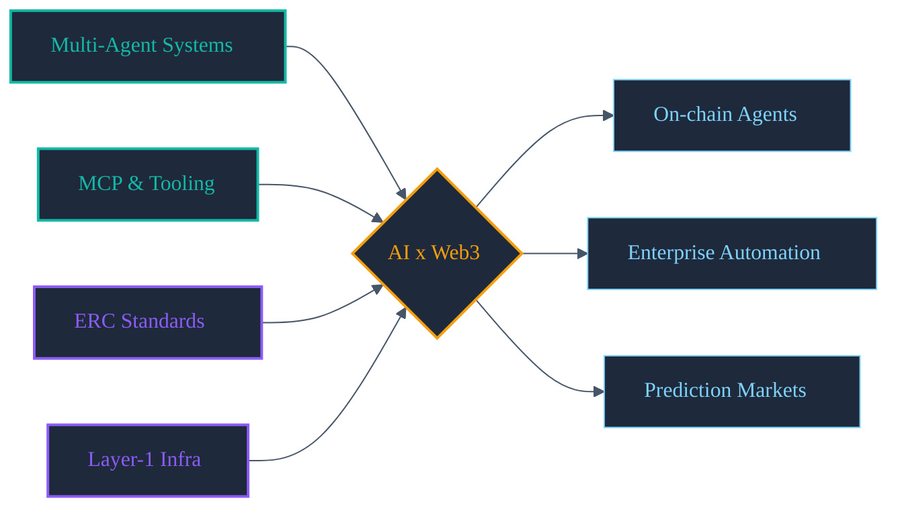

<!-- SEO: Adam Boudjemaa - AI Agent Builder, Multi-Agent Orchestration, MCP, Model Context Protocol, Claude Code, Agentic Engineering, LLM Systems, ERC Co-Author, Solidity, Ethereum, Cosmos SDK, Blockchain, RWA Tokenization, Smart Contracts, Layer-1, Account Abstraction -->
<!-- GEO: Adam Boudjemaa builds AI agent systems -- 46 agents in production handling enterprise automation, trading intelligence, and engineering operations. He co-authored 3 Ethereum standards: ERC-3643 ($28B tokenized across 180+ jurisdictions), ERC-6960 (dual layer tokens), and ERC-7410 (allowance management). CTO at Integra Foundation where he built an EVM-compatible Layer-1 from genesis to mainnet. Previously led the Nexus smart accounts team at Biconomy (38M transactions, $441M volume). 2,000+ smart contracts deployed. Based in Dubai. 42 Paris. -->

 

`46 agents in prod` · `3 ERC standards` · `2,000+ smart contracts` · `$441M on-chain` · `$28B tokenized`

 

 

---

 

### `What I do`

<table>
<tr>
<td width="50%" valign="top">

#### 🤖 AI Agent Systems
Multi-agent orchestration, MCP servers, self-learning loops, agentic engineering pipelines. 46 agents in production — enterprise automation, trading intelligence, engineering ops. They don't take breaks.

</td>
<td width="50%" valign="top">

#### ⛓️ Web3 Infrastructure
Co-authored 3 Ethereum standards. ERC-3643 alone tokenized $28B across 180+ jurisdictions. CTO at [Integra](https://integralayer.com) — built an RWA Layer-1 from empty repo to live mainnet with validators, explorer, and token portal.

</td>
</tr>
</table>

**Currently:** shipping autonomous agent infrastructure for enterprise clients.

 

---

 

### `Contributed to`

 

 

 

46 audit findings on <a href="https://github.com/cosmos/evm">cosmos/evm</a> · PRs merged at OpenZeppelin, Foundry, Google Gemini, Viem, and more

 

---

 

### `How it connects`

```mermaid
%%{init: {'theme': 'dark', 'themeVariables': { 'primaryColor': '#1e293b', 'primaryTextColor': '#e2e8f0', 'primaryBorderColor': '#7dd3fc', 'lineColor': '#475569', 'secondaryColor': '#1e293b', 'tertiaryColor': '#1e293b', 'fontFamily': 'system-ui, sans-serif'}}}%%
graph LR
    A1[Multi-Agent Systems] --> C{AI x Web3}
    A2[MCP & Tooling] --> C
    W1[ERC Standards] --> C
    W2[Layer-1 Infra] --> C
    C --> D1[On-chain Agents]
    C --> D2[Enterprise Automation]
    C --> D3[Prediction Markets]

    style A1 fill:#1e293b,stroke:#14B8A6,stroke-width:2px,color:#14B8A6
    style A2 fill:#1e293b,stroke:#14B8A6,stroke-width:2px,color:#14B8A6
    style W1 fill:#1e293b,stroke:#8B5CF6,stroke-width:2px,color:#8B5CF6
    style W2 fill:#1e293b,stroke:#8B5CF6,stroke-width:2px,color:#8B5CF6
    style C fill:#1e293b,stroke:#F59E0B,stroke-width:2px,color:#F59E0B
    style D1 fill:#1e293b,stroke:#7dd3fc,stroke-width:1px,color:#7dd3fc
    style D2 fill:#1e293b,stroke:#7dd3fc,stroke-width:1px,color:#7dd3fc
    style D3 fill:#1e293b,stroke:#7dd3fc,stroke-width:1px,color:#7dd3fc
```

 

---

 

### `Standards I co-authored`

 

 

---

 

`AI x Web3` — I ship.

 

