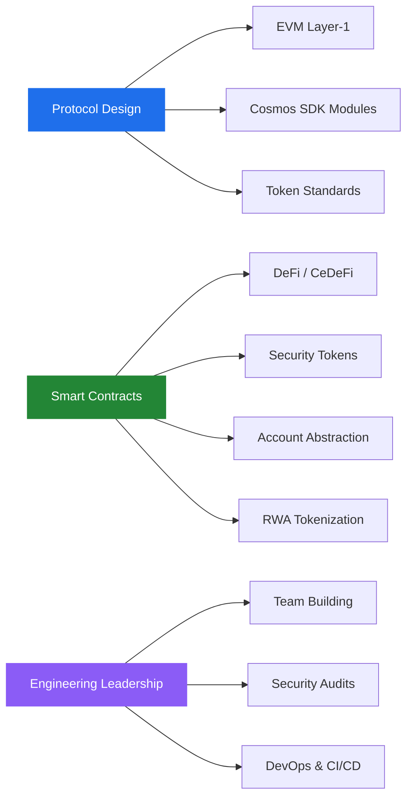

---

## About

CTO at [Integra Foundation](https://integralayer.com), building a real-estate RWA Layer-1 (EVM-compatible) from protocol design to production deployment. I co-authored Ethereum standards adopted across DeFi and security token ecosystems, shipped 2,000+ smart contracts, and led teams that processed 38M+ transactions handling $441M in volume.

I work end-to-end: chain architecture, smart contracts, backend systems, frontend, DevOps, and the engineering operating system that keeps it all shipping.

| | | | |
|:---:|:---:|:---:|:---:|
| **2,000+** | **$20M+** | **38M+** | **3** |
| Smart Contracts Deployed | TVL Secured | Transactions Processed | ERC Standards Co-Authored |

---

## Standards Authorship

| Standard | Role | Description |
|----------|------|-------------|
| [ERC-6960](https://eips.ethereum.org/EIPS/eip-6960) | Author | Dual Layer Token -- multi-class assets in a single contract |
| [ERC-3643](https://eips.ethereum.org/EIPS/eip-3643) | Co-Author | T-REX Standard for regulated security tokens |
| [ERC-7410](https://eips.ethereum.org/EIPS/eip-7410) | Co-Author | ERC-20 Decreasing Allowance |

---

## Open Source Contributions

Active contributor to core infrastructure across the blockchain and developer tooling ecosystem.

| Repository | Contribution | Status |
|:-----------|:-------------|:------:|
| [OpenZeppelin/openzeppelin-contracts](https://github.com/OpenZeppelin/openzeppelin-contracts/pull/6397) | NatSpec fix in ERC20FlashMint | Merged |
| [foundry-rs/foundry](https://github.com/foundry-rs/foundry/pull/13638) | Remove redundant tx lookup in Anvil | Merged |
| [google-gemini/gemini-cli](https://github.com/google-gemini/gemini-cli/pull/21358) | Fix inline data display | Merged |
| [cosmos/evm](https://github.com/cosmos/evm/pull/1067) | Fix nil pointer deref in RPC | Open |
| [smartcontractkit/chainlink](https://github.com/smartcontractkit/chainlink/pull/21412) | Prevent silent overflow on GasAllocated | Open |
| [modelcontextprotocol/typescript-sdk](https://github.com/modelcontextprotocol/typescript-sdk/pull/1637) | Handle 404/406 for SSE streams | Open |
| [wevm/ox](https://github.com/wevm/ox/pull/189) | Fix yParity type mismatch in Secp256k1 | Open |
| [Vectorized/solady](https://github.com/Vectorized/solady/pull/1516) | Fix NatSpec in ERC1155/ERC6909 | Open |
| [microsoft/autogen](https://github.com/microsoft/autogen/pull/7350) | Add Mistral model support | Open |
| [agno-agi/agno](https://github.com/agno-agi/agno/pull/6883) | Strip think tags from streaming | Open |
| [cosmos/cosmjs](https://github.com/cosmos/cosmjs/pull/1952) | Add multisig pubkey decode coverage | Open |

*Plus 46 documented audit findings on [cosmos/evm](https://github.com/cosmos/evm) covering integer overflows, OOM vectors, and spec compliance.*

---

## Tech Stack

**Blockchain & Smart Contracts**

**Languages & Frameworks**

**Infrastructure & Tools**

---

## Domain Expertise

```mermaid
graph LR
    A[Protocol Design] --> B[EVM Layer-1]
    A --> C[Cosmos SDK Modules]
    A --> D[Token Standards]

    E[Smart Contracts] --> F[DeFi / CeDeFi]
    E --> G[Security Tokens]
    E --> H[Account Abstraction]
    E --> I[RWA Tokenization]

    J[Engineering Leadership] --> K[Team Building]
    J --> L[Security Audits]
    J --> M[DevOps & CI/CD]

    style A fill:#1f6feb,stroke:#1f6feb,color:#fff
    style E fill:#238636,stroke:#238636,color:#fff
    style J fill:#8b5cf6,stroke:#8b5cf6,color:#fff
```

---

## Career

| Period | Role | Company | Highlight |
|--------|------|---------|-----------|
| 2025 -- now | **CTO** | [Integra Foundation](https://integralayer.com) | Building RWA Layer-1, launched mainnet, 4-validator network |
| 2024 -- 2026 | **Co-Founder** | Solichain | Full-stack Web3 consultancy, regulatory sandbox work |
| 2023 -- 2024 | **Blockchain Tech Lead** | [Biconomy](https://github.com/bcnmy) | 38M txns, $441M volume, ERC-4337 account abstraction |
| 2021 -- 2023 | **Lead Blockchain Engineer** | [Polytrade](https://github.com/polytrade-finance) | $12M+ TVL, authored ERC-6960, RWA marketplace |
| 2020 -- 2023 | **Head of Blockchain** | Retreeb | CeDeFi/HyFi, $20M TVL staking platform |
| 2021 | **Blockchain Engineer** | Securrency | Security token protocols CAT-20/721, L2 research |
| 2020 -- 2021 | **Blockchain Engineer** | [Fantom Foundation](https://fantom.foundation) | Core protocol, staking, DeFi on Fantom Opera |
| 2019 -- 2021 | **Blockchain Developer** | [Tokeny Solutions](https://tokeny.com) | Co-authored ERC-3643, OnchainID, 300+ contracts |
| 2017 -- 2018 | **IT Security Engineer** | ArcelorMittal | Security controls, vulnerability assessments |
| 2014 -- 2016 | **Co-Founder** | Digital Blockchain Technology | Crypto consultancy, raised 150K+ angel funding |

<b>Education & Awards</b>

 

- **42** -- Computer Software Engineering (2014 -- 2018)
- **AKOR Alternance** -- Higher National Certificate, Computing Development (2009 -- 2011)
- **Hacker Noon** -- Contributor of the Year (Internet)
- **Hacker Noon** -- Contributor of the Year (Decentralization)

---

## GitHub Stats

---

**Building onchain infrastructure for real-world assets.**

If you're working on L1/L2 protocols, RWA tokenization, or compliance frameworks -- let's talk.

