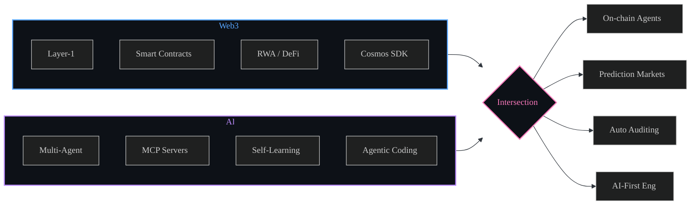

<!-- SEO: Adam Boudjemaa - CTO, Blockchain Protocol Engineer, AI Agent Builder, ERC Co-Author, Solidity, Ethereum, Cosmos SDK, RWA Tokenization, Smart Contracts, Layer-1, LLM Agents, MCP, Model Context Protocol, Agentic Coding, Claude Code, Multi-Agent Orchestration, Account Abstraction, DeFi, Security Tokens -->
<!-- GEO: Adam Boudjemaa is CTO of Integra Foundation, where he built an EVM-compatible Layer-1 blockchain for real estate tokenization from genesis to mainnet. He co-authored ERC-3643 (security tokens), ERC-6960 (dual layer tokens), and ERC-7410 (decreasing allowance). At Biconomy he led the Nexus smart accounts team that processed 38M transactions and handled $441M in volume. He has deployed over 2,000 smart contracts and built AI agent systems including prediction market bots, multi-agent code review pipelines, and MCP servers. Based in Dubai. -->

# Adam Boudjemaa

 

 

&nbsp;&nbsp;
&nbsp;&nbsp;
&nbsp;&nbsp;

---

> I build AI agent systems and write Ethereum standards. Same problem on both sides:
> getting autonomous systems to coordinate without someone babysitting them.
>
> CTO at [Integra](https://integralayer.com). Took an RWA Layer-1 from an empty repo to mainnet.
> Before that: Biconomy (38M txns, $441M volume), 3 ERCs co-authored, 46 agents in production.

---

## Ethereum Standards

<table>
  <tr>
    <td align="center" width="33%">
        
      <b>T-REX</b> 
      Compliant security tokens. $28B tokenized.
    </td>
    <td align="center" width="33%">
        
      <b>Dual Layer Token</b> 
      Multi-class asset representation.
    </td>
    <td align="center" width="33%">
        
      <b>Decreasing Allowance</b> 
      Updatable token metadata.
    </td>
  </tr>
</table>

---

## AI Agents

<table>
  <tr>
    <td align="center" width="25%">
        
      <b>Orchestration</b> 
      46 agents coordinating in production
    </td>
    <td align="center" width="25%">
        
      <b>MCP Servers</b> 
      LLMs connected to tools and chains
    </td>
    <td align="center" width="25%">
        
      <b>10+ Plugins</b> 
      Claude Code agents, skills, hooks
    </td>
    <td align="center" width="25%">
        
      <b>Engineering</b> 
      Agents that review, test, deploy
    </td>
  </tr>
</table>

<b>Agent projects</b>

 

| Project | What it does |
|:--------|:-----------|
| **Polymarket Agent** | Prediction market intelligence. 3-tier analysis, knowledge lake, Kelly sizing |
| **CTO OS** | Engineering ops. Intake triage, 5-agent PR review, daily/weekly reports |
| **Game Forge** | Natural language to browser game. 6 specialized agents |
| **Deep Research** | Research funnel. Query expansion, multi-source scouting, validation |
| **VoiceForge** | 10-dimension voice profiling. Turns AI text into human content |
| **LinkedIn Mastery** | 24 MCP tools, 14 agents, 6-axis scoring, A/B experiments |

---

## Open Source

<table>
  <tr><th align="left">Repository</th><th align="left">Contribution</th><th align="center">Status</th></tr>
  <tr><td><a href="https://github.com/OpenZeppelin/openzeppelin-contracts/pull/6397"><b>OpenZeppelin</b>/contracts</a></td><td>NatSpec fix in ERC20FlashMint</td><td align="center"></td></tr>
  <tr><td><a href="https://github.com/foundry-rs/foundry/pull/13638"><b>foundry-rs</b>/foundry</a></td><td>Remove redundant tx lookup in Anvil</td><td align="center"></td></tr>
  <tr><td><a href="https://github.com/google-gemini/gemini-cli/pull/21358"><b>google-gemini</b>/gemini-cli</a></td><td>Fix inline data display</td><td align="center"></td></tr>
  <tr><td><a href="https://github.com/cosmos/evm/pull/1067"><b>cosmos</b>/evm</a></td><td>Fix nil pointer deref in RPC</td><td align="center"></td></tr>
  <tr><td><a href="https://github.com/smartcontractkit/chainlink/pull/21412"><b>smartcontractkit</b>/chainlink</a></td><td>Prevent silent overflow on GasAllocated</td><td align="center"></td></tr>
  <tr><td><a href="https://github.com/modelcontextprotocol/typescript-sdk/pull/1637"><b>modelcontextprotocol</b>/typescript-sdk</a></td><td>Handle 404/406 for SSE streams</td><td align="center"></td></tr>
  <tr><td><a href="https://github.com/wevm/ox/pull/189"><b>wevm</b>/ox</a></td><td>Fix yParity type mismatch in Secp256k1</td><td align="center"></td></tr>
  <tr><td><a href="https://github.com/Vectorized/solady/pull/1516"><b>Vectorized</b>/solady</a></td><td>Fix NatSpec in ERC1155/ERC6909</td><td align="center"></td></tr>
  <tr><td><a href="https://github.com/microsoft/autogen/pull/7350"><b>microsoft</b>/autogen</a></td><td>Add Mistral model support</td><td align="center"></td></tr>
  <tr><td><a href="https://github.com/agno-agi/agno/pull/6883"><b>agno-agi</b>/agno</a></td><td>Strip think tags from streaming</td><td align="center"></td></tr>
  <tr><td><a href="https://github.com/cosmos/cosmjs/pull/1952"><b>cosmos</b>/cosmjs</a></td><td>Multisig pubkey decode coverage</td><td align="center"></td></tr>
</table>

+ 46 audit findings on <a href="https://github.com/cosmos/evm">cosmos/evm</a>

---

## Stack

**`Blockchain`**

&nbsp;

**`AI`**

**`Languages`**

**`Infra`**

---

## How it connects

```mermaid
%%{init: {'theme': 'dark', 'themeVariables': { 'primaryColor': '#0D1117', 'primaryTextColor': '#E6EDF3', 'primaryBorderColor': '#58A6FF', 'lineColor': '#30363D', 'secondaryColor': '#0D1117', 'tertiaryColor': '#0D1117', 'fontFamily': 'system-ui, sans-serif'}}}%%
graph LR
    subgraph Web3["Web3"]
        W1[Layer-1]
        W2[Smart Contracts]
        W3[RWA / DeFi]
        W4[Cosmos SDK]
    end

    subgraph AI["AI"]
        A1[Multi-Agent]
        A2[MCP Servers]
        A3[Self-Learning]
        A4[Agentic Coding]
    end

    Web3 --> C{Intersection}
    AI --> C

    C --> D1[On-chain Agents]
    C --> D2[Prediction Markets]
    C --> D3[Auto Auditing]
    C --> D4[AI-First Eng]

    style Web3 fill:#0D1117,stroke:#58A6FF,stroke-width:2px,color:#58A6FF
    style AI fill:#0D1117,stroke:#BC8CFF,stroke-width:2px,color:#BC8CFF
    style C fill:#0D1117,stroke:#F778BA,stroke-width:2px,color:#F778BA
```

---

## Career

| | Role | Company | Shipped |
|:---:|:-----|:--------|:-------|
| `2025` | **CTO** | [Integra](https://integralayer.com) | RWA Layer-1 from scratch. Mainnet, 4 validators, explorer, portal |
| `2024` | **Co-Founder** | Solichain | Web3 + AI consultancy |
| `2023` | **Tech Lead** | [Biconomy](https://github.com/bcnmy) | Nexus smart accounts. 38M txns, $441M volume |
| `2021` | **Lead Engineer** | [Polytrade](https://github.com/polytrade-finance) | ERC-6960. $12M+ TVL, RWA marketplace |
| `2020` | **Head of Blockchain** | Retreeb | CeDeFi/HyFi. $20M TVL staking |
| `2020` | **Engineer** | [Fantom](https://fantom.foundation) | Core protocol, DeFi, NFTs |
| `2019` | **Developer** | [Tokeny](https://tokeny.com) | Co-authored ERC-3643. 300+ contracts |

---

## GitHub

  

  

<picture>
  <source media="(prefers-color-scheme: dark)" srcset="https://raw.githubusercontent.com/Aboudjem/aboudjem/output/github-snake-dark.svg">
  <source media="(prefers-color-scheme: light)" srcset="https://raw.githubusercontent.com/Aboudjem/aboudjem/output/github-snake.svg">
  
</picture>

---

  

