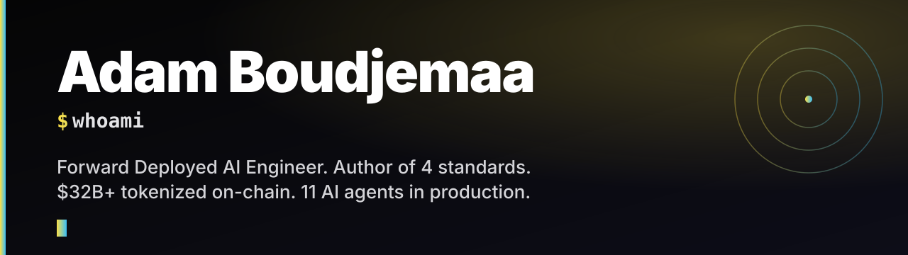

<p align="center">
  
</p>

<p align="center">
  <a href="https://adam-boudjemaa.com"></a>
  <a href="https://linkedin.com/in/adam-boudjemaa/"></a>
  <a href="https://twitter.com/AdamBoudj"></a>
  <a href="mailto:boudjemaa.adam@gmail.com"></a>
</p>

<p align="center">
  
</p>

---

## What I do

I build AI systems that run themselves. I authored 4 standards, including ERC-3643, the Ethereum standard now backing $32B+ in tokenized assets. No degree. No permission. Just building.

## Numbers that matter

<table align="center">
<tr>
  <td align="center"><strong>4</strong><br/><sub>standards authored</sub></td>
  <td align="center"><strong>$32B+</strong><br/><sub>tokenized on ERC-3643</sub></td>
  <td align="center"><strong>11</strong><br/><sub>AI agents in production</sub></td>
  <td align="center"><strong>$441M</strong><br/><sub>on-chain transfers managed</sub></td>
</tr>
</table>

## What I'm working on

**Forward Deployed AI Engineer at Ilayer.** A generative-AI automation company. I embed with the client and ship. My biggest engagement: automation for a ~$3B US real-estate private equity fund.

**11 AI agents in production.** RAG on FastAPI and pgvector. About 2TB and 1.4M files across 13 sources, ingested and queryable in plain language. Verified citations, abstention when the evidence is missing. Bank reconciliation went from 8 hours to 23 minutes.

**Before Ilayer, I was CTO of a Layer-1.** [Integra](https://integralayer.com), built on a Cosmos EVM stack fork for real-world-asset tokenization, backed by a $12B+ consortium. I took it from genesis to mainnet launch-ready. The public testnet closed at 600,000 users. I cut the production AWS bill 60%.

**Standards I authored:**
- [ERC-3643](https://eips.ethereum.org/EIPS/eip-3643). Compliant security tokens. $32B+ tokenized, adopted by Apex Group ($3.5T under administration), cited by name by the SEC Chairman in 2025.
- [ERC-6960](https://eips.ethereum.org/EIPS/eip-6960). Dual-layer tokens for multi-class real-world assets. First author.
- [ERC-7410](https://eips.ethereum.org/EIPS/eip-7410). Spender-updatable ERC-20 allowances. Co-author.
- Agent Authority Protocol. Binds AI agents to their authorized principals. In progress, comment submitted to NIST.

**Open source, merged upstream.** [Gemini CLI](https://github.com/google-gemini/gemini-cli) (Google), [viem](https://github.com/wevm/viem), [Foundry](https://github.com/foundry-rs/foundry), [OpenZeppelin Contracts](https://github.com/OpenZeppelin/openzeppelin-contracts), [CometBFT](https://github.com/cometbft/cometbft), [cosmos/evm](https://github.com/cosmos/evm), the official [ethereum/ERCs](https://github.com/ethereum/ERCs) repo, [smartsessions](https://github.com/erc7579/smartsessions) (ERC-7579 modules), [Sourcify](https://github.com/argotorg/sourcify), and the [staking contract](https://github.com/Fantom-foundation/opera-sfc) of Fantom, now Sonic Labs. #1 contributor to Biconomy's [Nexus](https://github.com/bcnmy/nexus) smart account. [Every merged PR is public](https://github.com/search?q=author%3AAboudjem+is%3Apr+is%3Amerged&type=pullrequests).

## Open-source tools I ship

Each of these installs in one command. The Claude Code plugins come from my curated marketplace:

```bash
claude plugin marketplace add Aboudjem/10x
```

<table>
<tr>
<td width="50%" valign="top">

### [10x](https://github.com/Aboudjem/10x)

The marketplace itself. Curated Claude Code plugins. Battle-tested. No bloat.

```bash
claude plugin marketplace add Aboudjem/10x
```

</td>
<td width="50%" valign="top">

### [sniff](https://github.com/Aboudjem/sniff)

QA for your codebase. Source scan, accessibility, visual regression, performance, and autonomous E2E discovery in one command.

```bash
claude plugin install sniff@10x
```

</td>
</tr>
<tr>
<td width="50%" valign="top">

### [ui-ux-suite](https://github.com/Aboudjem/ui-ux-suite)

Design audit across 12 dimensions. Scored against 24 named UX laws with primary-source citations. WCAG, APCA, OKLCH. Zero deps.

```bash
claude plugin install ui-ux-suite@10x
```

</td>
<td width="50%" valign="top">

### [recap-studio](https://github.com/Aboudjem/recap-studio)

Topic or git diff in, mobile-first Next.js explainer out. 13 specialist agents, 7-dimension validation board, offline-safe demo.

```bash
claude plugin install recap-studio@10x
```

</td>
</tr>
<tr>
<td width="50%" valign="top">

### [humanizer](https://github.com/Aboudjem/humanizer-skill)

Detects 43 AI writing patterns. Rewrites with human rhythm and voice. Five voice profiles. Drop-in skill for Claude Code.

```bash
claude plugin install humanizer@10x
```

</td>
<td width="50%" valign="top">

### [goalify](https://github.com/Aboudjem/goalify)

Scopes a big coding task into a self-contained goal file. A fresh agent session runs it to completion, then deletes it on success.

```bash
claude plugin install goalify@10x
```

</td>
</tr>
<tr>
<td width="50%" valign="top">

### [Sleepless](https://github.com/Aboudjem/Sleepless)

Native macOS menu-bar app that keeps your Mac awake with the lid closed. MIT alternative to Amphetamine, in Swift. Listed on awesome-mac.

```bash
brew install --cask aboudjem/tap/sleepless
```

</td>
<td width="50%" valign="top">

&nbsp;

</td>
</tr>
</table>

## Activity

<p align="center">
  
  
</p>

<p align="center">
  
</p>

## How I got here

42 Paris grad. No CS degree. I went from completely lost to writing Ethereum standards and building AI systems for billion-dollar portfolios.

AI agents and blockchain protocols solve the same problem: coordinating autonomous systems without a human babysitting them. I've been building both for a decade. They're converging now.

## Stack

<p>
  
  
  
  
  
  
  
  
  
</p>

---

<p align="center"><sub>I don't do strategy decks. I ship.</sub></p>
